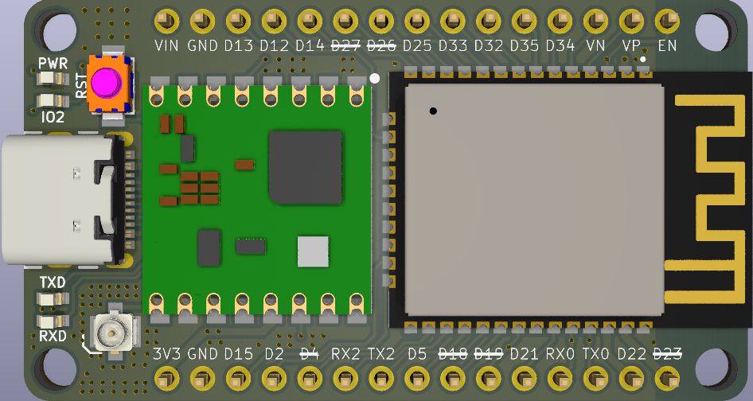
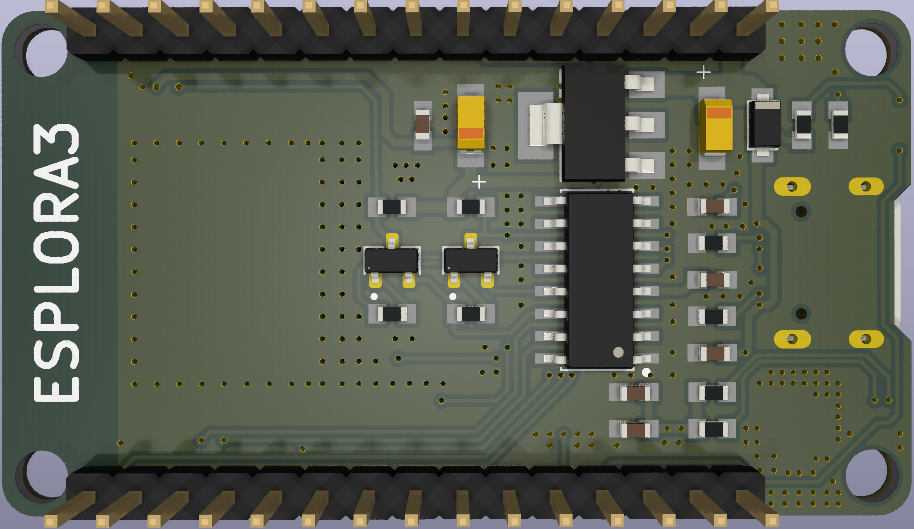

# ESPLORA3

ESPLORA3 adalah modul yang menggabungkan **ESP32** dan **LoRa** dalam satu board. Modul ini mendukung komunikasi **Point-to-Point (P2P)** serta **LoRaWAN** seperti Antares, TTN, Loriot dan semisalnya, sehingga cocok untuk berbagai aplikasi IoT dan jaringan nirkabel jarak jauh.

## Fitur Utama

- **Mikrokontroler**: ESP32 dengan dual-core dan konektivitas WiFi serta Bluetooth
- **Modul LoRa**: Lora SX1276/77/78/79 yang mendukung komunikasi Long Range dengan Frekuensi 433/915/923.
- **Dukungan Pengembangan**: Kompatibel dengan platform Arduino, MicroPython, dan ESP-IDF
- **Multiprotokol LoRa** : Mendukung protokol Point to Point dan LoRaWan Antares.

## Konfigurasi Pin ESP32 ke LoRa

| Pin ESP32 | PIN LORA |
|-----------|----------|
| 23        | MOSI     |
| 19        | MISO     |
| 18        | SCK      |
| 26        | NSS      |
| 0         | RST      |
| 4         | IO0      |
| 27        | IO1      |

## Tampilan Board

### Tampak Atas


### Tampak Bawah


## Penggunaan

1. **Pengujian Awal**
   - Hubungkan antena LoRa ke konektor UFL yang tersedia.
   - Hubungkan USB Type C ke modul **ESPLORA3**.
   - Buka Serial Monitor dengan Beudrate 115200
   - Tekan tombol Reset modul **ESPLORA3**
   - Ikuti menu petunjuk yang tampil di serial monitor

2. **Pemrograman**  
   - Gunakan **Arduino IDE** atau **PlatformIO** untuk mengembangkan firmware.
   - Install ESP32 pada Board Manager
   - Install library LoRa atau Antares LORAWAN.

3. **Implementasi Jaringan**  
   - **Point-to-Point**: Gunakan dua board ESPLORA3 untuk komunikasi langsung.
   - **ANTARES LoRaWAN**: Hubungkan ke ke Platform Antares untuk integrasi dengan jaringan LPWAN (Pastikan lokasi anda sudah tercover).

## Program
### P2P
```cpp
#include <SPI.h>
#include <LoRa.h>

// Define the pins used by the transceiver module
#define ss 26 
#define rst 0 
#define dio0 2

int counter = 4;

void setup() {
  Serial.begin(115200);
  while (!Serial);

  LoRa.setPins(ss, rst, dio0);
  
  // Ganti dengan frekuensi sesuai wilayah:
  // 433E6 untuk Asia
  // 868E6 untuk Eropa
  // 915E6 untuk Amerika Utara
  // 923E6 untuk Indonesia
  while (!LoRa.begin(923E6)) {  
    Serial.println(".");
    delay(500);
  }

  LoRa.setSyncWord(0xF3); // Device address
  Serial.println("LoRa Initializing OK!");
}
..........
```

### Antares LoRaWAN
```cpp
#include <lorawan.h>

// ABP Credentials
const char *devAddr = "Lora-Device-Address"; // Ganti dengan Device Address dari Antares
const char *nwkSKey = "Network-Session-Key"; // Ganti dengan Network Session Key dari Antares
const char *appSKey = "Application-Session-Key"; // Ganti dengan Application Session Key dari Antares

// ESPLORA3 Connections
const sRFM_pins RFM_pins = {
    .CS = 26,
    .RST = 0,
    .DIO0 = 4,
    .DIO1 = 27,
};

void setup() {
  Serial.begin(115200);
  delay(2000);
  
  if (!lora.init()) {
    Serial.println("RFM95 tidak terdeteksi");
    delay(5000);
    return;
  }

  lora.setDeviceClass(CLASS_A);  // Set LoRaWAN Class change CLASS_A or CLASS_C
  lora.setDataRate(SF10BW125);  // Set Data Rate
  lora.setChannel(MULTI);  // set channel to random
  lora.setTxPower1(15);  // Set TxPower to 15 dBi (max)

  // Put ABP Key and DevAddress here
  lora.setNwkSKey(nwkSKey);
  lora.setAppSKey(appSKey);
  lora.setDevAddr(devAddr);
}
..............

```

## Pembelian
ESPLORA3 dapat dibeli melalui **Tokopedia**:  
🔗 [Beli di Tokopedia](https://www.tokopedia.com/sakanaelectronics/esplora3-lora-esp32-lorawan-sx1276-rfm95-esp-32)

## Referensi

- [Tutorial Lora P2P](https://randomnerdtutorials.com/esp32-lora-rfm95-transceiver-arduino-ide/)
- [Panduan LoRaWAN Antares](https://docs.antares.id/contoh-kode-dan-library/esp32-lora)

## Tentang Kami
ESPLORA3 dibuat oleh **PT Kreasi Sakana Elektronik**, sebuah perusahaan yang bergerak di bidang pengembangan perangkat elektronik dan IoT.  

---

Jika ada pertanyaan atau ingin berkontribusi dalam proyek ini, silakan hubungi kami melalui repositori ini atau marketplace di atas.


